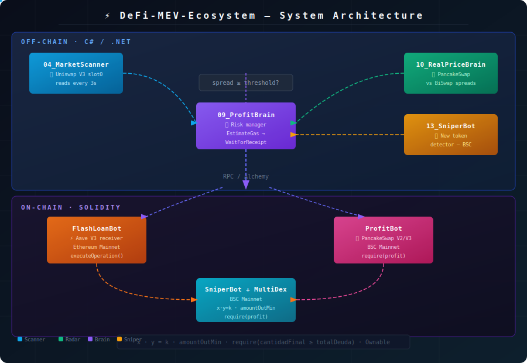
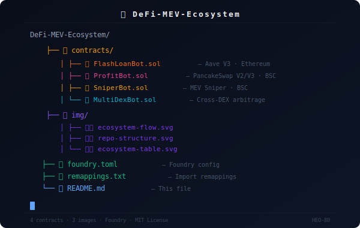

<div align="center">

# ⚡ DeFi-MEV-Ecosystem


**Complete MEV & DeFi arbitrage ecosystem — Flash Loans, Multi-DEX arbitrage and token sniping on BSC & Ethereum**

[](https://www.linkedin.com/in/hectorob/)
[](https://github.com/HEO-80)

</div>

---

## 🧬 What is this?

This repository is the **central documentation and unified contract layer** of a complete MEV ecosystem built from scratch. It contains the four core Solidity contracts and links to the full off-chain C# controller series that drives them.

The system was built iteratively — each repo is a step on the ladder, from a local Anvil test to autonomous operation on BSC Mainnet.

---


---

## 🏗️ System Architecture



---

## 📦 Contracts

### `FlashLoanBot.sol` — Aave V3 Flash Loan Receiver *(full code)*
- Inherits `FlashLoanSimpleReceiverBase` (Aave V3 official base)
- Receives uncollateralized loans via `executeOperation()`
- Interfaces with Uniswap V3 `ISwapRouter` → `exactInputSingle`
- Full revert if repayment (`amount + premium`) cannot be covered
- **Network:** Ethereum Mainnet · fork testing via Anvil

### `MultiDexBot.sol` — Multi-DEX Arbitrage *(full code)*
- Cross-DEX price imbalance exploitation
- `EstimateGasAsync` before broadcast — prevents failed transactions
- `SendTransactionAndWaitForReceiptAsync` — synchronous execution
- Receipt status: `1` = profit retained · `0` = revert
- **Network:** BSC / Ethereum

### `ProfitBot.sol` — Gas-Optimized BSC Arbitrage *(architecture only)*
- Buy on **PancakeSwap V3** → Sell on **PancakeSwap V2**
- Dynamic gas estimation · atomic revert on loss · `Ownable`
- **Network:** BNB Chain Mainnet
- *Full implementation private — [contact via LinkedIn](https://www.linkedin.com/in/hectorob/)*

### `SniperBot.sol` — Autonomous MEV Token Sniper *(architecture only)*
- DexScreener detection → GoPlus security check → honeypot filter → atomic swap
- TP/SL management · blacklist · tax simulation
- **Network:** BSC Mainnet
- *Full implementation private — [contact via LinkedIn](https://www.linkedin.com/in/hectorob/)*

## 📦 Contracts in this repo

### `contracts/FlashLoanBot.sol` — Aave V3 Flash Loan Receiver
- Inherits `FlashLoanSimpleReceiverBase` (Aave V3 official base)
- Receives uncollateralized loans via `executeOperation()`
- Interfaces with Uniswap V3 `ISwapRouter` for `exactInputSingle`
- Full revert if repayment (`amount + premium`) cannot be covered
- **Network:** Ethereum Mainnet (fork testing via Anvil)

### `contracts/ProfitBot.sol` — Gas-Optimized BSC Arbitrage
- Buy on **PancakeSwap V3** (`exactInputSingle`) → Sell on **PancakeSwap V2** (`swapExactTokensForTokens`)
- Dynamic gas estimation before every execution
- `require(cantidadFinal >= totalDeuda)` — atomic revert on loss
- `Ownable` — `retirarToken()` and `retirarETH()` restricted to deployer
- **Network:** BNB Chain Mainnet (`--legacy` flag required)

### `contracts/SniperBot.sol` — MEV Token Sniper
- Real-time new token detection on BSC via DexScreener API
- GoPlus Security API integration — honeypot detection, tax simulation
- Execution aborts if buy/sell tax > 10% or contract blocks selling
- Atomic swap via PancakeSwap with dynamic `amountOutMin`
- **Network:** BSC Mainnet

### `contracts/MultiDexArbitrage.sol` — Multi-DEX Arbitrage
- Cross-DEX price imbalance exploitation
- `EstimateGasAsync` before broadcast — prevents failed transactions
- `SendTransactionAndWaitForReceiptAsync` — synchronous execution
- Receipt status validation: `1` = profit retained, `0` = revert
- **Network:** BSC / Ethereum

---

## 🗺️ Full Ecosystem — Repo by Repo



---


| Phase | Repo | Role | Network |
|:---:|:---|:---|:---|
| 1 | [Flash_Loans](https://github.com/HEO-80/Flash_Loans) | ⚡ Aave V3 base receiver | Ethereum |
| 2 | [03_FlashLoanDriver](https://github.com/HEO-80/03_FlashLoanDriver) | 🚀 Local driver — Anvil testing | Local |
| 3 | [04_MarketScanner](https://github.com/HEO-80/04_MarketScanner) | 📡 Uniswap V3 slot0 reader | Local fork |
| 4 | [05_ArbitrageBot](https://github.com/HEO-80/05_ArbitrageBot) | 🤖 V1 — first real Flash Loan trigger | Local |
| 5 | [06_MultiDexArbitrage](https://github.com/HEO-80/06_MultiDexArbitrage) | 🧠 Full cycle + receipt validation | BSC/ETH |
| 6 | [07_MultiDexBrain](https://github.com/HEO-80/07_MultiDexBrain) | 🔄 V2 — refined architecture | BSC/ETH |
| 7 | [08_GasOptimizedBot](https://github.com/HEO-80/08_GasOptimizedBot) | ⚡ Gas-optimized — BNB Mainnet | BSC |
| 8 | [09_ProfitBrain](https://github.com/HEO-80/09_ProfitBrain) | 💰 Off-chain controller + risk mgmt | BSC |
| 9 | [10_RealPriceBrain](https://github.com/HEO-80/10_RealPriceBrain) | 🎯 Multi-DEX spread radar | BSC |
| 10 | [13_SniperBot](https://github.com/HEO-80/13_SniperBot) | 🏹 Autonomous MEV sniper | BSC |


---

## 🔬 Key Technical Concepts

**Flash Loans** — uncollateralized loans that must be borrowed, used and repaid within a single block. If repayment fails, the entire transaction reverts as if it never happened.

**MEV (Maximal Extractable Value)** — value extracted from users by reordering, inserting or censoring transactions within a block. This ecosystem focuses on arbitrage and sniping strategies.

**AMM Formula** — `x * y = k`. All price calculations in this ecosystem derive from this constant product formula used by Uniswap V2/V3 and PancakeSwap.

**slot0** — the most gas-efficient read function in Uniswap V3 pools. Returns `sqrtPriceX96`, `tick` and liquidity data in a single call.

**Receipt Status** — `1` = transaction succeeded and profit was retained. `0` = contract detected a loss and reverted — funds are safe.


---

## 🏗️ Repository Structure



---

```
DeFi-MEV-Ecosystem/
├── contracts/
│   ├── FlashLoanBot.sol          # Aave V3 Flash Loan receiver (Ethereum)
│   ├── ProfitBot.sol             # Gas-optimized arbitrage (BSC Mainnet)
│   ├── SniperBot.sol             # MEV token sniper (BSC)
│   └── MultiDexArbitrage.sol     # Cross-DEX arbitrage
├── docs/
│   └── architecture.md           # Extended architecture notes
├── foundry.toml                  # Foundry configuration
└── README.md                     # This file
```

---

## 🚀 Quick Start

### Run contracts locally (Foundry)
```bash
# Fork Ethereum Mainnet
anvil --fork-url https://eth-mainnet.g.alchemy.com/v2/YOUR_KEY

# Fork BSC Mainnet
anvil --fork-url https://bsc-mainnet.g.alchemy.com/v2/YOUR_KEY

# Build
forge build

# Test
forge test -vv
```

### Deploy ProfitBot to BSC Mainnet
```bash
forge create --rpc-url $ALCHEMY_URL_BNB \
  --private-key $PRIVATE_KEY \
  --broadcast \
  --legacy \
  contracts/ProfitBot.sol:ProfitBot
```

> ⚠️ `--legacy` is mandatory on BNB Chain for type 0 transactions.

### Run the off-chain radar
```bash
# Clone and configure any off-chain controller
cd 10_RealPriceBrain
cp .env.example .env   # fill ALCHEMY_URL, PRIVATE_KEY, BOT_ADDRESS
dotnet run

```
---

## ⚖️ Disclaimer

This project is for **educational and DeFi research purposes only**.

The authors are not responsible for financial losses, regulatory violations, or any damages from using this software. Operating on Mainnet involves **real financial risk**. By using this software you acknowledge and accept these terms.

---

## 🧑‍💻 Author

**Héctor Oviedo** — Backend Developer & DeFi Researcher

[](https://www.linkedin.com/in/hectorob/)
[](https://github.com/HEO-80)

---

<div align="center">
  <sub>Built with ☕ and MEV research · <strong>Héctor Oviedo</strong> · Zaragoza, España</sub>
</div>